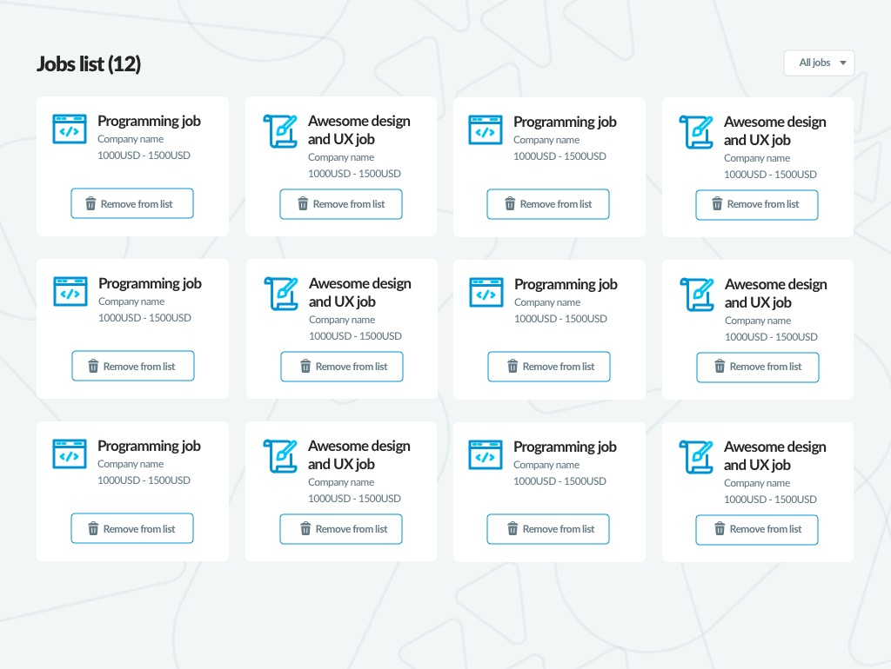

# React challenge

Challenge to assess your skills in React

## 💻 Instructions

You will create a list of jobs requesting our [Public API](https://api-doc.getonbrd.com/). In order to build this UI you should follow the mockup bellow but it is not mandatory to follow the same exact look & feel.



You can use any dependency if you need it (CSS or JavaScript) but try to keep it simple.

## 👉 Required features

- List jobs included in the categories `programming` and `design-ux` from our [Public API](https://api-doc.getonbrd.com/).
- A state in the front with the jobs serialized by id using the following structure:
```javascript
1: {
  id: 1,
  title: 'Job title',
  ...,
},
2: {
  id: 2,
  title: 'Job title',
  ...,
}
```
- Capability to filter jobs by category with a select (See mockup).
- Update jobs count and title based on filters. Titles should be:
  - Jobs (%{count})
  - Programming jobs (%{count})
  - Design/UX jobs (%{count})
- Capability to remove items from the list, but just at the front-end level. You can include a fake request to the backend removing the item but this is not mandatory.
- Change the job icon depending on the category.

## 🙌 Extra points but not required

- Replicate the exact same look & feel from the mockup.
- Show job's details clicking on the item.
- Follow accessibility standards.
- Confirm alert to remove items.
- Any eye candy UI feature to improve the usability that you consider important.
- Self-contained components using a functional approach.
- Responsive list view. In phones items have to be arranged one per row.
- A suite of tests.

## ⚡️ Jobs API

To request the jobs by category you have to use our [Public API](https://api-doc.getonbrd.com/).

## 📸 Assets
All the needed images are included in this scaffold inside the folder [./public/images](./public/images). You can allso include icons libraries or emojis if you want.

## 👩‍💻 To run the environment

This project was bootstrapped with [Create React App](https://github.com/facebook/create-react-app). If you already have set up your Node environment you just need to run: 

```shell
$ yarn
$ yarn start
```

## ⁉️ Troubleshooting
- Issues with CORS in local requesting the API? Don't spend time on this, even if you are using a browser extension to skip CORS it is ok.
- Too much time building CSS? We are providing scaffold styles with BEM convention in the `index.css` file. These styles don't replicate the mockup look & feel, but it is enough to complete the challenge.
- In the API, each job has the attribute `category_name`. This attribute can be in English or Spanish. Consider this when you are coding.

## 🦶 Steps

- Fork this repo
- Complete the code by implementing the missing features
- Push your repo
- Create a pull request

Important: You have **4 hours** to complete the challenge. No more time, just **4 hours**.

## 📃 Disclaimer

This is an exercise without any commercial purpose and Get on Board will never by any means:

- Use your code
- Oblige you to take this exercise
- Compensate you in any form for taking this exercise

Have fun 🥳 and stay safe at 🏠.
